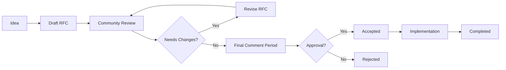

# RFC Process: Request for Comments

## What is an RFC?

A **Request for Comments (RFC)** is a design document that describes a new feature, enhancement, or significant change to LinEnum-Enhanced. The RFC process ensures that major decisions are made transparently with community input.

## When to Write an RFC

You should write an RFC for:

✅ **Major architectural changes**
- Plugin system design
- Output format modifications
- Core algorithm changes

✅ **Breaking changes**
- Command-line interface modifications
- Output format breaking changes
- API modifications

✅ **New significant features**
- Web dashboard
- AI-powered features
- Enterprise integrations

✅ **Process changes**
- Development workflows
- Release procedures
- Community governance

❌ **You DON'T need an RFC for:**
- Bug fixes
- Minor documentation updates
- Small feature additions
- Performance optimizations without API changes

## RFC Lifecycle

## RFC Process Steps

### 1. Pre-RFC Discussion (Optional)
- Discuss your idea in GitHub Discussions
- Get initial feedback from maintainers
- Validate the need for an RFC

### 2. Write the RFC
- Fork the repository
- Copy `docs/RFC-TEMPLATE.md` to `docs/rfcs/XXXX-feature-name.md`
- Fill out the template
- Submit a pull request

### 3. Community Review (2 weeks)
- RFC is announced in community channels
- Community provides feedback via PR comments
- Author addresses feedback and updates RFC
- Maintainers may request specific reviewers

### 4. Final Comment Period (1 week)
- Maintainers call for "Final Comment Period"
- Last chance for major objections
- No substantial changes during this period
- Only clarifications and minor fixes

### 5. Decision
- Maintainers make final decision
- RFC is either **Accepted** or **Rejected**
- Decision rationale is documented

### 6. Implementation
- Accepted RFCs move to implementation
- Implementation can be done by RFC author or others
- RFC is updated with implementation details

## RFC Template

Every RFC must include:

1. **Summary** - One paragraph explanation
2. **Motivation** - Why is this needed?
3. **Detailed Design** - How does it work?
4. **Drawbacks** - What are the downsides?
5. **Alternatives** - What other approaches were considered?
6. **Unresolved Questions** - What needs to be figured out?

## RFC Numbering

RFCs are numbered sequentially:
- RFC #001: Plugin Architecture Design
- RFC #002: JSON Output Schema
- RFC #003: Enterprise API Design

## Review Criteria

RFCs are evaluated on:

### Technical Merit
- Does it solve a real problem?
- Is the design sound?
- Are there simpler alternatives?

### Community Impact
- How many users will benefit?
- Does it align with project goals?
- Is it worth the maintenance burden?

### Implementation Feasibility
- Can it be implemented reasonably?
- Are there sufficient resources?
- What's the timeline?

### Backward Compatibility
- Does it break existing functionality?
- Is there a migration path?
- How will it affect users?

## Active RFCs

| RFC | Title | Author | Status | Discussion |
|-----|-------|--------|--------|------------|
| #001 | Plugin Architecture Design | @maintainer | Draft | [PR #123](https://github.com/example/pr/123) |
| #002 | JSON Output Schema | @contributor | Review | [PR #124](https://github.com/example/pr/124) |
| #003 | Enterprise API Design | @community | Planning | TBD |

## RFC Champions

Each RFC should have a **champion** who:
- Drives the RFC through the process
- Responds to feedback
- Updates the RFC as needed
- Helps with implementation

## FAQ

### Q: How long does the RFC process take?
**A:** Typically 3-4 weeks (2 weeks review + 1 week FCP + decision time)

### Q: Can I implement while the RFC is being reviewed?
**A:** You can create a prototype, but no final implementation until acceptance

### Q: What if my RFC is rejected?
**A:** The feedback helps you understand concerns. You can revise and resubmit

### Q: Who can write an RFC?
**A:** Anyone! Community members, contributors, and maintainers

### Q: Can I co-author an RFC?
**A:** Yes! Collaboration is encouraged

## RFC Best Practices

### Writing Tips
- **Be specific** - Vague RFCs are hard to evaluate
- **Show examples** - Code samples and use cases help
- **Consider edge cases** - Think about what could go wrong
- **Be honest about drawbacks** - Acknowledge limitations

### Review Tips
- **Be constructive** - Suggest improvements, not just problems
- **Ask questions** - Help clarify unclear points
- **Consider all users** - Not just your use case
- **Be respectful** - Remember there's a person behind the RFC

## RFC Communication

### Announcements
- New RFCs announced in Discord and community calls
- Weekly RFC updates in community newsletter
- Milestone-related RFCs highlighted in roadmap updates

### Discussion Channels
- **GitHub PR Comments** - Detailed technical discussion
- **Discord #rfc-discussion** - Quick questions and clarifications
- **Community Calls** - Verbal discussion of complex topics

## RFC Archive

Completed RFCs are moved to:
- **Accepted**: `docs/rfcs/accepted/`
- **Rejected**: `docs/rfcs/rejected/`
- **Withdrawn**: `docs/rfcs/withdrawn/`

## Getting Help

Need help with the RFC process?
- Ask in #rfc-discussion Discord channel
- Mention @maintainers in GitHub
- Join weekly community calls
- Review existing RFCs for examples

---

*The RFC process is inspired by [Rust's RFC process](https://github.com/rust-lang/rfcs) and adapted for LinEnum-Enhanced's needs.*