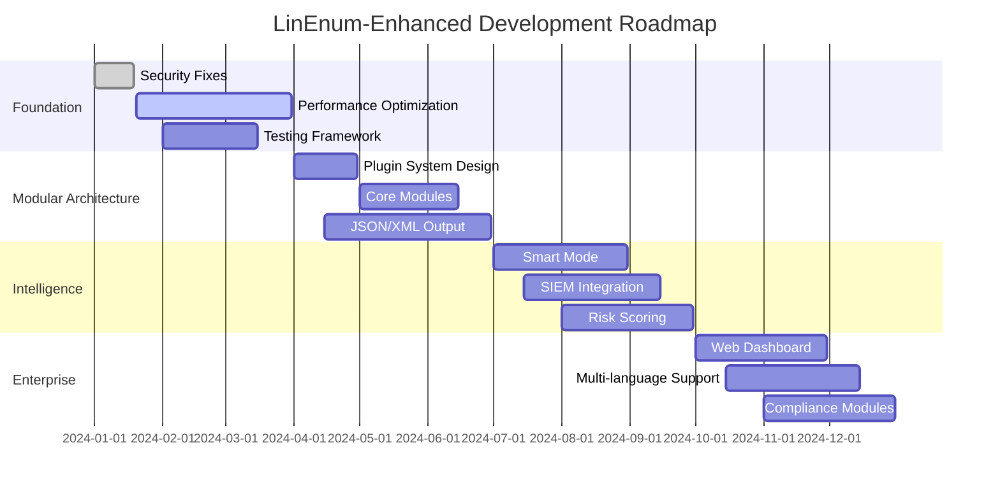
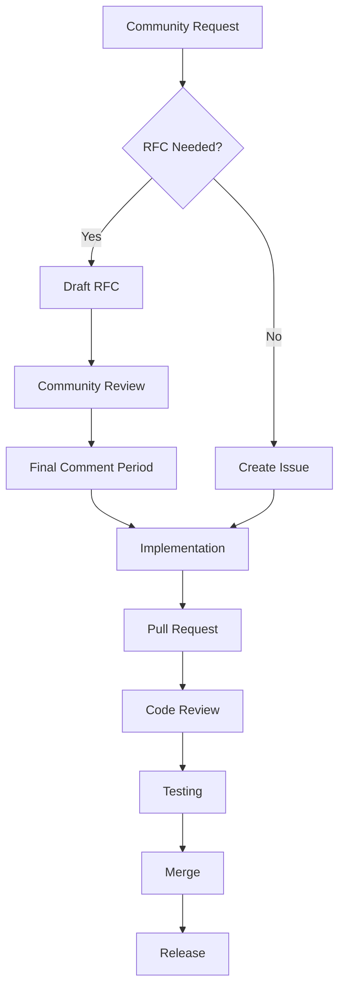
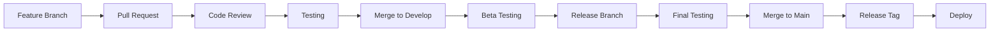

# LinEnum-Enhanced Visual Roadmap 📊

## 🗺️ Development Timeline



## 🏗️ Architecture Evolution

```
v1.0 (Current)           v2.0 (Q2 2024)           v3.0 (Q4 2024)
┌─────────────────┐      ┌─────────────────┐      ┌─────────────────┐
│   LinEnum.sh    │  →   │  Core Engine    │  →   │  Enterprise     │
│   (Monolithic)  │      │                 │      │   Platform      │
│                 │      ├─────────────────┤      │                 │
│  All functions  │      │  System Module  │      ├─────────────────┤
│  in one file    │      │  User Module    │      │  Web Dashboard  │
│                 │      │  Network Module │      │  API Gateway    │
└─────────────────┘      │  Plugin System  │      │  Multi-tenant   │
                         └─────────────────┘      └─────────────────┘
```

## 🎯 Feature Development Flow



## 📈 Community Growth Goals

```
GitHub Stars Timeline:
│
2k ┤     ╭─
   │    ╱
1k ┤   ╱
   │  ╱
500┤ ╱
   │╱
100┤●
   │
 0 └─────────────────────
   Q1   Q2   Q3   Q4
  2024 2024 2024 2024
```

## 🔧 Technology Stack Evolution

### Current (v1.0)
```
┌─────────────┐
│   Bash      │
│   Script    │
└─────────────┘
```

### Near Future (v2.0)
```
┌─────────────┐
│   Core      │
│   Engine    │
├─────────────┤
│   Plugins   │
│  (Modules)  │
├─────────────┤
│ JSON/XML    │
│  Output     │
└─────────────┘
```

### Long Term (v3.0)
```
┌─────────────┐
│ Web UI      │
├─────────────┤
│ REST API    │
├─────────────┤
│ Core Engine │
├─────────────┤
│ Plugin Sys  │
├─────────────┤
│ Data Layer  │
└─────────────┘
```

## 🌟 Feature Priority Matrix

```
High Impact, Low Effort     │ High Impact, High Effort
• Performance optimization  │ • Modular architecture
• JSON output              │ • Web dashboard
• Better error handling    │ • AI features
─────────────────────────────┼─────────────────────────────
Low Impact, Low Effort      │ Low Impact, High Effort
• Documentation updates    │ • Blockchain integration
• UI improvements          │ • AR/VR visualization
• Translation additions    │ • Quantum-resistant checks
```

## 🔄 Release Cycle



## 📊 Success Metrics Dashboard

### Development Velocity
```
Commits per week:  ████████████████ 100%
Issues closed:     ██████████████   87%
PRs merged:        ██████████       63%
Tests passing:     ████████████████ 99%
```

### Community Health
```
New contributors:  ████████         50%
Response time:     ██████████████   85%
Discussion activity: ████████████   75%
Star growth:       ██████           37%
```

## 🚀 Innovation Pipeline

### Research & Development
1. **AI-Powered Enumeration** (Experimental)
   - Machine learning for anomaly detection
   - Automated exploit suggestion
   - Behavioral analysis

2. **Cloud-Native Features** (Beta)
   - Kubernetes operator
   - Serverless scanning
   - Multi-cloud support

3. **Next-Gen Security** (Concept)
   - Quantum-resistant cryptography
   - Zero-trust enumeration
   - Privacy-preserving scans

## 🌍 Global Expansion Plan

```
Phase 1: English-speaking markets
├── United States 🇺🇸
├── United Kingdom 🇬🇧
├── Canada 🇨🇦
└── Australia 🇦🇺

Phase 2: European markets
├── Germany 🇩🇪
├── France 🇫🇷
├── Spain 🇪🇸
└── Netherlands 🇳🇱

Phase 3: Asia-Pacific
├── Japan 🇯🇵
├── China 🇨🇳
├── India 🇮🇳
└── South Korea 🇰🇷

Phase 4: Global expansion
├── Brazil 🇧🇷
├── Russia 🇷🇺
├── Middle East 🇦🇪
└── Africa 🇿🇦
```

---

*This visual roadmap is updated monthly. For detailed information, see [ROADMAP.md](../ROADMAP.md)*